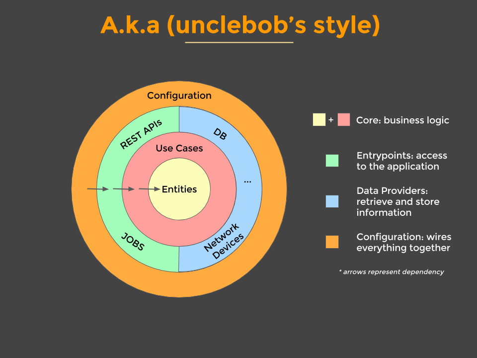

# Clean Architecture

This repo is a demo of the presentation Thoughts on Clean Architecture.

## Directory Structure

Original contains code that has all business logic dumped into the handler. This is one approach to writing code,
it's something I've done and seen done often.

Refactored contains code that I have refactored as based on the Clean Architecture design pattern.

The below diagram gives a representation of Clean Architecture. Retrieved from 
[here](https://cdn-images-1.medium.com/max/1200/0*rFs1UtU4sRns5vCJ.png)

